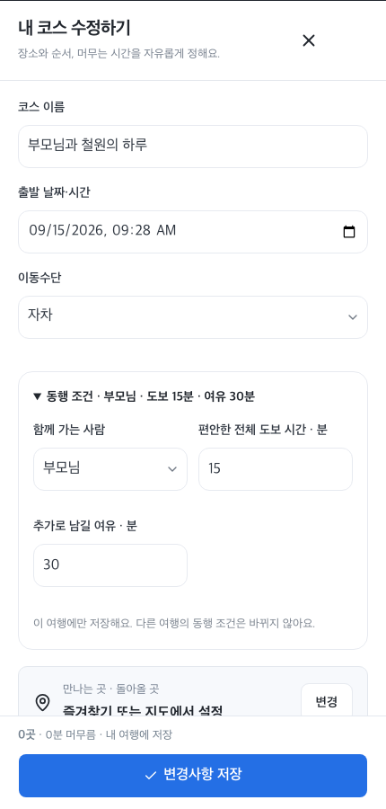

# 1차 기능심사 준비와 재현 시나리오

2026-09-15. **① 웹·앱 개발 부문**. [현행 공지](https://lowly-polyanthus-1fb.notion.site/2026-36b5dce406e380e0a3d1f80525667a11)의 지정 계정과 실제 API 활용 조건을 따른다. 최종 제출은 참가자 계정에서 9/21 16:00 KST 이전에 별도로 완료해야 한다.

현재 공식 접속 주소는 **https://gunbeon.gangwon.kr/login**이다. 9/15 새 도메인의 HTTPS·Google/Naver 로그인·기존 예시 여행 복원·지도를 확인했다. [전환 검증](../reports/custom_domain_live_2026-09-15.md). 9/17 지정 일반 계정의 새 HTTP 세션 로그인과 기존 예시 4개·그룹 2개 보존을 재확인했다. [최종 제출 검토](../reports/final_submission_review_2026-09-17.md).

## 심사자에게 보여줄 순서

1. 공개 서비스 `/login`에서 지정 **전용 심사 계정**으로 일반 로그인한다. ChatGPT/SNS나 체험 비밀번호 추가 입력 없이 홈이 열리는지 확인한다. 예시 데이터는 실제 이용 기록이 아님을 `[예시]`로 표시한다.
2. 가족 그룹의 여행을 열고 동행자를 새 초대로 참여시킨다. ‘내 여행에 담기’를 눌러 개인 사본의 돌아올 예정 시각을 직접 정하고 저장한다. 그룹 공동 원본과 개인 사본의 수정은 자동 동기화되지 않는다.
3. 예시 날짜는 고정되어 있으므로 일정표의 출발·돌아올 시각을 원하는 테스트 날짜로 바꾼다. ‘동행 조건’을 펼친다. 부모님 여행은 짧은 도보·충분한 여유, 친구 여행은 다른 값으로 설정한다. 다른 여행을 편집한 뒤 다시 열어도 각각 유지되는지 보여준다.
4. ‘장소 추가 → 관광정보 검색’에서 실제 TourAPI 장소를 찾아 담고 상세·주차·편의 정보를 확인한다. 호출이 실패하면 실패와 기본자료 사용을 그대로 설명한다. 정상 호출 증거를 대체 자료로 대신하지 않는다.
5. ‘여유 조정’에서 한 곳 생략 또는 체류시간 감소 전후의 복귀 여유·도보 추정을 비교한다. 적용 결과를 확인하고, 저장 전에는 조정을 되돌릴 수 있다. 확정한 뒤 저장한다. 교통 실측·예약 확정·군 복귀 보장으로 표현하지 않는다.
6. ‘현재 출타’에서 지금 돌아올 기준을 확인하고 시작한다. 실제 다녀온 장소만 골라 여행 완료 → 하루의 한 장 → 기록 ⋮ 수정/계획 복원으로 이어간다. 심사 예시에 자동 진행 중 출타를 저장하지 않는다.
7. 준비 중 여행의 ‘한 수 부탁하기’에서 공개할 장소와 질문을 확인한다. 다른 브라우저로 링크를 열어 구체적인 장소 제안 → 작성자가 검토·실제 저장 → 반영 표시를 시연한다. 초대(72시간)·공개 링크(30일)는 시연 때 새로 만든다.

대표 기능설명서에는 위 흐름을 **5개 기능**으로 묶는다. [공식 양식 대응표와 배점별 점검](../reports/judging_readiness_review_2026-09-15.md)을 사용한다. 계정·장애 대응은 서비스 완성도 근거로 설명한다.

## 변경된 사용법



- 날짜 없는 둘러보기 → 코스 선택 → 일정표에서 날짜와 개인 기준 설정.
- ‘동행 조건’ 요약을 눌러 함께 갈 사람·전체 도보 희망 시간·추가 여유를 수정한다. 해당 여행에만 저장한다.
- 그룹 편집은 공동 장소·순서·출발 시각을 다룬다. 복귀 여유 조정은 개인 사본의 기준을 입력한 뒤 사용한다.
- 그룹의 ‘이 여행 동행 브리핑’은 선택 일정의 지역·날짜·이동수단으로 **새 여행안**을 만든다. 원본의 특정 장소에 대한 접근성 검증으로 설명하지 않는다.

사진은 9/15 Chromium에서 촬영한 실제 구현 화면이다. 360/430/1440px는 데스크톱 브라우저의 화면 크기 모의이며 실제 휴대폰 검증과 구분한다.

## 전용 계정의 일회 준비

`web/scripts/prepare-judge-account.mjs`는 일반 가입·로그인·개인 상태 revision·그룹 API만 사용한다. 실행에는 `JUDGE_BASE_URL`, `JUDGE_HANDLE`, `JUDGE_PASSWORD`, `JUDGE_TEST_PASSWORD` 환경변수와 `--apply`가 필요하다. 값은 지정 심사용 규격을 사용하고 공개 저장소나 일반 앱 설정에 운영자 개인 비밀번호를 넣지 않는다.

```sh
cd web
node --experimental-strip-types scripts/prepare-judge-account.mjs --apply
```

- 이미 같은 아이디가 있으면 **409에서 중단**한다. 비밀번호 초기화나 다른 사람의 상태 덮어쓰기를 하지 않는다. 초기화 완료 후 다시 실행하지 않는다.
- 실패했다면 출력된 준비 기록의 생성 계정 ID·저장 revision·그룹 ID를 확인한다. 부분 초기화 상태를 재현하고 필요한 누락분만 정상 API로 보완한다. 운영 DB 전체 초기화나 사용자 계정 정리는 금지한다.
- 4개 합성 개인 예시와 가족/친구 그룹 각 1개를 준비한다. 정상 조회한 TourAPI 식사 후보가 있으면 **참조 ID만** 일정에 저장한다. 원문 응답·사진을 DB에 적재하지 않는다.
- 두 번째 쿠키 없는 세션에서 로그인·4개 개인 예시·2개 그룹·여행별 조건 복원을 검증한다. 개인 개발 브라우저의 여행을 가져오지 않는다.
- 여러 심사자가 같은 계정을 쓸 때 revision 충돌 안내가 발생할 수 있다. 기존 여행을 직접 바꾸기보다 사본으로 실험하게 안내한다. 로그인할 때 예시를 자동 덮어쓰지 않는다.

## 제출 직전 확인

지정 PDF 10MB 이하, 대표 이미지 1개·주요 화면 3~5개, 실제 사용 API 목록/키, 접속 URL/계정, 지역특화 내용과 공개 이미지 권리를 확인한다. 개인 계정/암호·API 키는 주최 측 지정 비공개 입력란으로 제출한다. 기능설명서에 단순 준비한 API를 실제 활용한 API로 쓰지 않는다. 서버는 10월 기능심사와 발표 확인 기간 동안 계속 유지한다.
