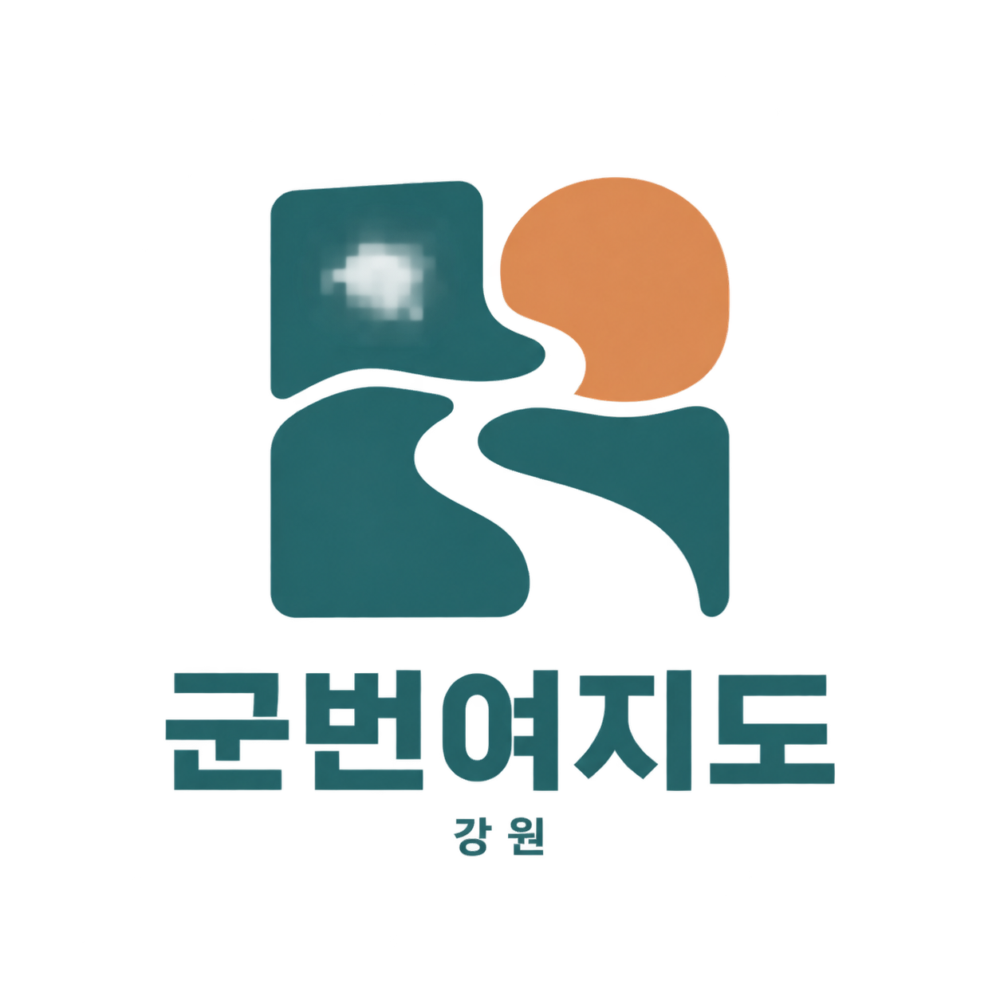

# 군번여지도 로고 3안

2026-09-15 사용자 요청: 로고 후보 세 가지를 먼저 제시하고, 선택 후 해당 안으로 140×140 로고와 서비스 등록·홍보용 대표 이미지 키트를 제작한다.

현재 단계는 **후보 선택**이다. 기존 서비스의 로고와 배포 파일은 변경하지 않는다.

| 안 | 이름 | 전달할 의미 |
|---|---|---|
| A | 하루의 문 | 열린 여권과 아침 햇빛. 함께 시작하는 여행 |
| B | 다시 만나는 길 | 합류와 돌아옴을 담은 하나의 길. 동행과 복귀 |
| C | 강원의 네 창 | 코스의 여러 장소를 하나로 묶는 여행 창문 |

단색 실루엣, 작은 크기의 식별성, 기존 청록·살구색과의 연결을 기준으로 탐색한다. 생성 방식은 내장 image_gen이며 정확한 프롬프트는 `prompts.json`에 보관한다. 이미지는 방향 선택용 콘셉트로, 최종 로고 파일·140×140 출력·홍보 키트는 선택 후 정리한다.

선택 후 준비할 키트: 앱 등록용 정사각형 로고(140×140 포함), 큰 원본, 투명/밝은 배경/어두운 배경 버전, 서비스명과 결합한 가로형, SNS·공모전 대표 이미지, 색상·여백·사용 규칙과 출처/작업 기록. 실제 등록처의 별도 규격이 있으면 그 규격도 적용한다.

## 후보 이미지

생성 원본 PNG를 그대로 보관했다. 아래 이미지는 최종 벡터 마스터가 아닌 선택용 시안이다. 투명 배경이며 밝은 배경에서 비교하면 색과 빈 공간을 보기 쉽다. 최종 키트에서는 표면 질감과 가장자리를 정리하고 심벌 단독·서비스명 조합을 별도로 제작한다.

| A · 하루의 문 | B · 다시 만나는 길 | C · 강원의 네 창 |
|---|---|---|
|  |  |  |

추천은 **A**다. 열린 여권과 그 사이로 이어지는 길이 서비스의 여행·기록 성격을 직접적으로 전달한다. B는 간결한 G 형태의 기억성, C는 여러 장소를 묶는 코스 표지와의 연결이 장점이다. 최종 선택은 사용자 응답 후 기록한다.

검수: 세 PNG의 서비스명 ‘군번여지도’와 지역명 ‘강원’, 구도와 색을 직접 확인했다. 앱 코드 변경이 없으므로 앱 빌드·기능 검사는 다시 실행하지 않았다. 공개 서비스 배포는 기존 v17을 유지한다.
