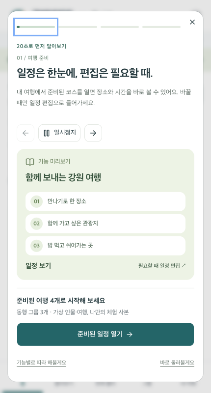
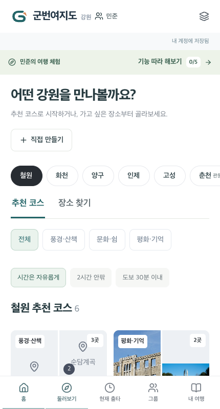
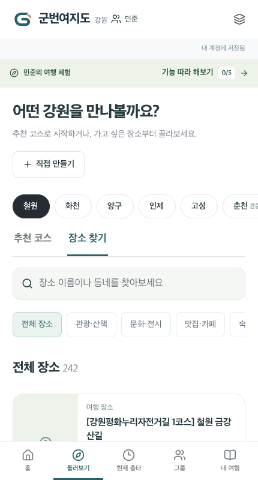

# 9/21 콘텐츠·빠른 시작·접속 개선

사용자의 1차 심사 완료 후 후속 개선 요청. 기존 지정 심사 계정·개인 여행·그룹은 초기화하지 않는다. 제출 문서 v3.2는 당시 제출본으로 보존한다.

## 구현

- 추천 코스 15 → **36개**: 철원·화천·양구·인제·고성 각 6개, 춘천·속초 각 3개. 권역과 실제 장소명을 대조하고 2~3개 장소로 연결했다. 관광지 운영·예약 가능을 추정해 확정하지 않으며 체류·도보·이동은 초안이다. 가벼운 코스/도보 필터를 추가했다.
- 기존 지역 공개자료 607건을 유지하면서 관광공사 목록을 5종에서 **7종**(레포츠·시장/쇼핑 추가)으로 확장. ‘장소 찾기’에서 종류·이름·동네 검색, 상세 확인, 한 장소로 새 일정 만들기, 추가 목록 조회를 제공한다. 원문 응답/사진을 D1에 적재하지 않는다.
- 100개 이후 장소는 실제 제공자 `pageNo`로 조회한다. 페이지 수를 표시하기 위해 가짜 장소나 동일 첫 페이지를 재사용하지 않는다. 오류면 이미 본 목록을 유지하며 다시 시도할 수 있다.
- 정상 인증을 마친 지정 일반 계정과 독립 민준 체험에 **20초 자동 안내**를 적용했다. 재생/일시정지/장면 이동/건너뛰기·모션 감소를 지원한다. 5단계 가이드는 준비된 일정 보기, 편집, 동행 그룹, 한 수, 현재 출타 화면으로 연결한다. 자동으로 저장·출타 시작·공유하지 않는다. 판별 함수는 UI 전용이며 인증 우회가 아니다.
- 계정 조회와 여행 hydration을 private/no-store 단일 응답으로 묶었다. 계정 문맥 확인 후 그룹·해당 권역 관광정보를 조회해 초기 중복 작업을 줄였다. 6초 뒤 연결 지연 안내, 20초 계정 통신 제한/실패 안내, 공개 관광 조회 45초 제한을 둔다. 실패한 개인 상태를 빈 상태로 덮지 않는다.
- 사용 가이드와 실제 화면을 갱신했다. 둘러보기는 날짜 없이 탐색하고 저장 일정에서 날짜/시간을 정하는 계약을 유지한다.

## 실제 데이터 확인

[실제 API 검사](qa/content-guided-entry/live-content.json): 9/21 로컬 서버가 실제 인증키로 국문 관광정보에 요청했다. 키와 원문 응답은 보고서에 저장하지 않았다.

| 지역 | 첫 목록 실제 응답 | 기본자료 결합·중복 정리 후 표시 | 완전한 추천 코스 |
|---|---:|---:|---:|
| 철원 | 143 | 242 | 6 |
| 화천 | 101 | 158 | 6 |
| 양구 | 85 | 135 | 6 |
| 인제 | 155 | 209 | 6 |
| 고성 | 184 | 256 | 6 |
| 춘천 | 331 | 331 | 3 |
| 속초 | 256 | 256 | 3 |

관광공사 첫 목록 합계 **1,255건**, 제공량은 갱신된다. 춘천 관광지 105건 중 페이지 2의 나머지 5건을 정상 수신했고 첫 페이지 ID와 중복 없음·마지막 페이지 종료를 확인했다. 7개 권역 모두 7종 조회 HTTP 200. 관문 코스는 실제 API 장소가 모두 조회될 때만 표시하며, 실패 시 허구의 대체 장소를 생성하지 않는다.

춘천 문학 코스는 [춘천 공식 관광 안내](https://www.chuncheon.go.kr/tour/main/)와 실제 TourAPI 장소명을 대조했다. 속초 외옹치는 [관광공사 관광 안내](https://www.kctg.or.kr/tour/touristSiteView.do?tourist_cd=TOURIST_ID00010303) 및 레포츠 API 응답으로 확인했다. 나머지는 `place_node`의 공개 원천과 TourAPI 응답을 활용했다. 새 외부 사진의 다운로드/저작권 확대는 없다.

## 검사 및 화면 검토

- TypeScript·120개 단위 검사 통과. 신규 검사는 코스 완전성·직접입력 장소 제외·실제 다음 페이지·잘못된 요청 차단·UI 안내 대상 판별을 검증한다.
- Chromium 민준 UI 360/430/1440px: 자동 안내 진입, 감소된 모션, 일정 보기, 공유 카드 PNG, 재진입/그룹 연결 통과.
- Chrome 장소 탐색 360/430/1440px: 자동 재생/일시정지/건너뛰기, 코스/종류/검색/빈 결과/더 보기, 관문 코스, 상세·새 일정 연결 통과. Chromium 430px는 지역 변경의 렌더링 완료를 기다리도록 검사 조건을 보완한 뒤 재통과했다. 실물 휴대폰 검사가 아니며 Edge는 이 PC에 없어 실행하지 않았다.
- 계정 API: 합쳐진 bootstrap의 no-store/다른 계정 문맥 차단, 충돌 저장·이전 쿠키 권한·정상 로그인 13회 회귀 통과. 민준 독립 사본·권한 제한·다시 로그인·다른 탭 저장 차단 통과.
- 기존 심사 시나리오 360/430/1440px의 여행별 조건 독립성 통과.
- [지연/실패 UX 검사](qa/content-guided-entry/loading/results.json)는 **네트워크 모의**다. 지연 상태/재연결 버튼과 실패 시 hydration 중단을 확인했다. 실제 서버 장애 재현으로 주장하지 않는다.

## 접속 지연 분석

[변경 전 HTTP 측정](qa/content-guided-entry/http-before.json): 공식 루트 최초 접속→로그인 총 4.47초, 바로 로그인 0.37초, 익명 계정 조회 0.17초. 플랫폼 루트도 3.89초, 직접 로그인 0.22초였다. 도메인 DNS/SSL만의 문제라고 단정할 근거는 없다. 플랫폼/Worker 첫 처리 지연 가능성이 있으며 단발 측정으로 원인을 확정하지 않는다.

배포 전 최근 Worker 오류 조회의 제한된 표본은 주로 정상 401·스캐너 404였고 실행 예외나 5xx는 없었다. 이는 전체 무장애나 SLA 증거가 아니다. 앱에서 줄일 수 있는 직렬 통신·무한 대기·사용자 피드백부터 보완했다. 운영 반영 후 계정 보존·접속 재측정 결과는 아래에 추가한다.
