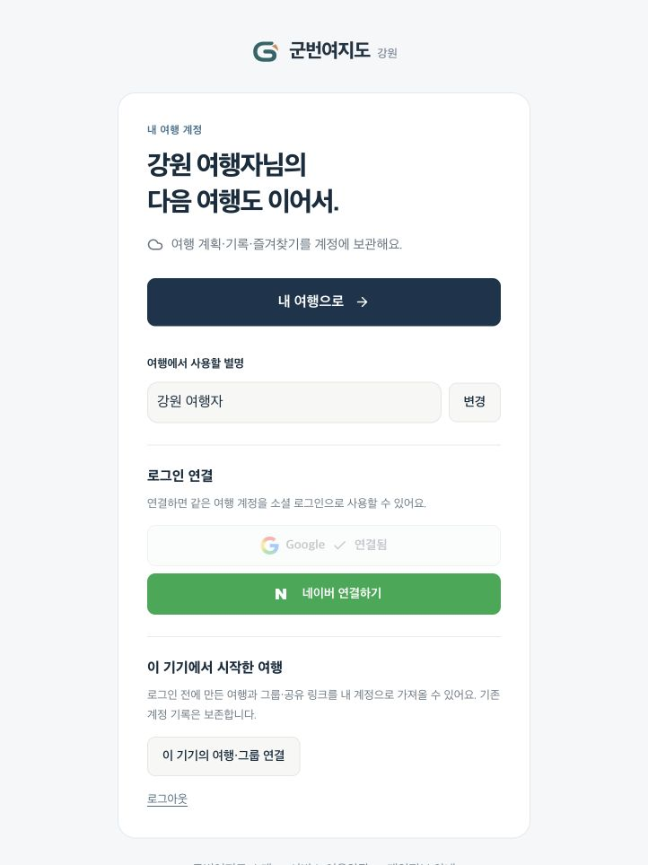
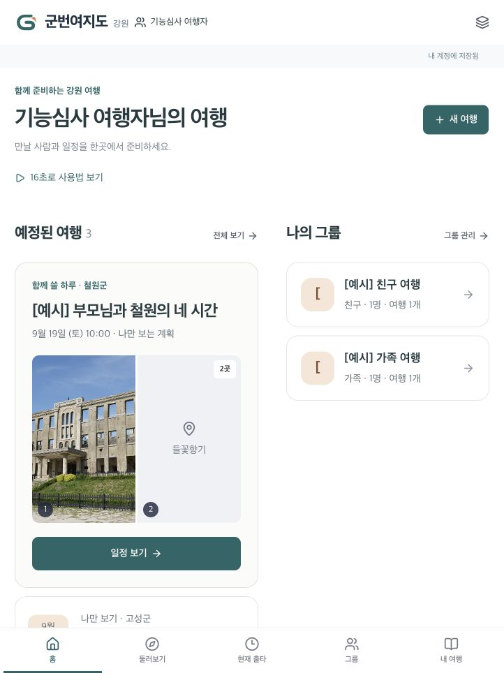
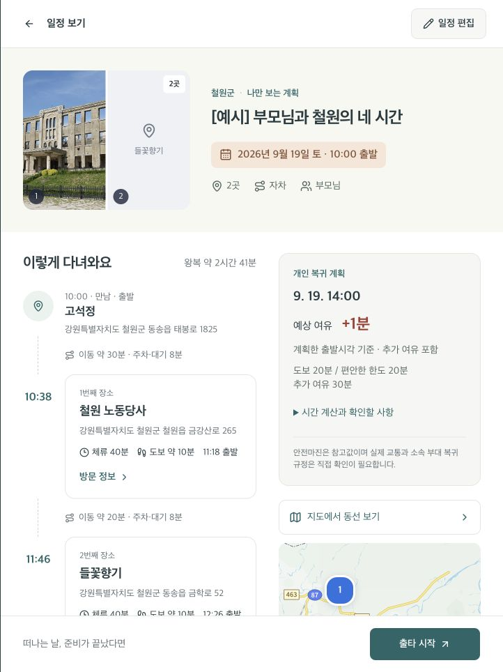

# gunbeon.gangwon.kr 운영 전환 완료

2026-09-15. 사용자가 Google/Naver/Kakao에 새 도메인 추가를 완료했다고 알려 준 뒤, HTTPS와 실제 서비스 연결을 확인하고 운영 origin을 전환했다.

## 배포와 설정

| 항목 | 결과 |
|---|---|
| 공식 서비스 | https://gunbeon.gangwon.kr |
| 로그인 | https://gunbeon.gangwon.kr/login |
| Sites 프로젝트 | `appgprj_6a9e5a33eaa08191a72a52abf77522cc` — 기존 운영 유지 |
| 커스텀 도메인 | `appgdom_6aa8d01a4d0481918a5c8ce10d2ed2ba` |
| 도메인 상태 | status / provider / SSL 모두 active · 08:31:56 UTC |
| 운영 환경 | `AUTH_BASE_URL`·`PUBLIC_SITE_URL` = `https://gunbeon.gangwon.kr` · env revision5 |
| 앱 버전 | 기존 v19 재사용 · `appgprj_6a9e5a33eaa08191a72a52abf77522cc~appgver_1094cb816de48191abd8ac1e8901721b` |
| Sites source | `9790ac308766aecae662e71d7bdc0e2b5050fb38` |
| 배포 | `appgdep_6aa902d37c9881919acaabdf9f2d45e1` · succeeded · 08:33:36 UTC |
| 플랫폼이 반환한 배포 URL | https://gunbeon-yeojido-gangwon.ybuser.chatgpt.site |

앱 코드·DB 스키마는 변경하지 않았다. 운영 D1·기존 Google/Naver 앱·모든 API/체험 Secret은 보존했다. 별도 개발 Site v2/env2는 그대로다. 도메인을 중복 등록하지 않았다.

초기에는 SSL active·provider active_redeploying이고 HTTPS가 Sites 404를 반환했다. 모든 상태가 active로 바뀐 뒤 실제 `/login`·`/about`·`/terms`·`/api/account`의 정상 응답을 확인하고 env를 전환했다. Python 기본 CA 저장소 검사 실패는 별도로 있었으며, TLS 검증을 끄지 않고 시스템 curl로 인증서와 HTTPS 응답을 확인했다.

## 실제 검증

| 흐름 | 관측 결과 |
|---|---|
| 새 주소 계정 API | HTTP 200, 비로그인 account null, google/naver true |
| Google 시작 요청 | HTTP 200, Google authorization endpoint, 새 주소 `/api/auth/callback/google`, openid·S256 |
| 실제 Google 로그인 | `/login`의 Google 버튼 → 제공자 인증 흐름 → 새 주소 홈 → `/account`의 Google 연결됨 |
| Naver 시작 요청 | HTTP 200, Naver authorization endpoint, 새 주소 `/api/auth/callback/naver` |
| 실제 Naver 재로그인 | 앱 로그아웃 → Naver 버튼 → 새 주소 홈. 기존 예시 계획3·그룹2 조회 |
| 기존 개인 여행 | 부모님 철원 일정의 9/19 10:00, 노동당사/들꽃향기, 개인 기준14:00·여유+1분 확인 |
| Kakao 지도 | 일정의 ‘지도에서 동선 보기’ → 실제 지도 타일, 고석정/노동당사/들꽃향기 마커 확인 |
| 기존 그룹 | 가족 그룹의 공유 여행1개 정상 조회. 그룹 복귀 기준은 개인별 표시 유지 |
| 공개 문서/메타데이터 | about/privacy/terms 정상. OG 기준이 새 origin으로 변경됨 |
| 기존 플랫폼 주소 | 계정 API HTTP 200, 익명 account null, google/naver false: 의도한 origin 보호 |

두 소셜 로그인은 기존 브라우저 제공자 세션을 이용해 돌아왔으며 새 동의 화면 검수나 브랜드 승인을 증명하지 않는다. Google과 Naver 계정을 합치거나 서로 연결하지 않았다. 지정 심사 계정은 기존 상태를 조회했고 여행·그룹·연동을 변경/초기화하지 않았다. 신규 초대 생성/참여, 새 여행 쓰기, 실제 휴대폰 검사는 이번 전환 검증에 포함하지 않았다. TourAPI 새 한도나 신규 일괄 호출 성공을 이번 도메인 전환으로 주장하지 않는다.

## 실제 캡처

IAB에서 새 도메인으로 직접 실행해 촬영했다. 기본 Google 별명과 검증용 심사 별명/합성 예시만 포함하며 이메일·실명·비밀번호·토큰은 없다.

지도 캡처는 화면에 보이는 범위이며 전체 동선은 접근성 트리에서도 세 마커와 Kakao 출처를 확인했다.

## 이용자와 다음 작업

- 앞으로 로그인은 `https://gunbeon.gangwon.kr/login`에서 한다. 기존과 **같은 로그인 방식/계정**을 이용하면 기존 서버 기록을 조회한다. 서로 연결하지 않은 Google/Naver 계정은 별개의 여행 계정이다.
- 기존 chatgpt.site의 일반 로그인·기존 페이지는 유지한다. 소셜 로그인은 새 운영 origin에서만 활성화되며 교차 origin 쿠키 보호를 해제하지 않는다. 체험 localStorage는 주소별이므로 자동 이동하지 않는다. 필요한 체험 기록은 기존 주소에서 계정에 가져온 뒤 새 주소에서 같은 계정으로 로그인한다.
- README·현행 소셜 설정·사용자 가이드·심사 진입 주소를 갱신했다. 과거 배포/네이버 검수 캡처의 URL은 촬영 당시 기록으로 보존한다.
- Google 브랜드 검수와 네이버 최종 검수/캡처 URL 정합성은 별도 후속이다. 이번 사용자 확인은 새 주소 등록 완료이며 브랜드 승인까지 완료됐다고 해석하지 않는다.
- 제출 전 새 주소에서 지정 일반 심사 로그인·초대 참여·최종 제출 자료를 리허설한다. SSL/호스팅/외부 API 운영 조건과 DB 복구 경로도 기존 계획대로 관리한다.
- 장애 시 두 origin 환경변수를 이전 값으로 되돌리고 저장된 검증 버전을 재배포한다. DB를 개발 데이터로 덮어쓰거나 기존 계정을 재생성하지 않는다.

소스 수정이 없어 앱 단위·빌드를 반복하지 않고 배포 대상 검사·실제 HTTPS/API·브라우저 OAuth/복원/지도를 확인했다. 문서 링크와 diff 검사를 수행하고 캡처·운영 기록을 GitHub에 commit/push한다.
