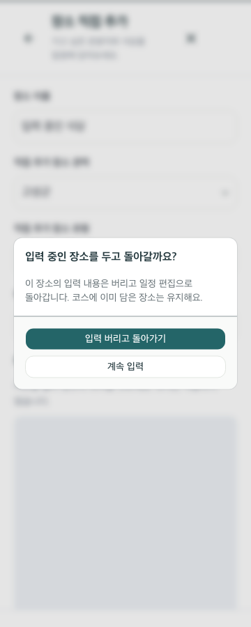
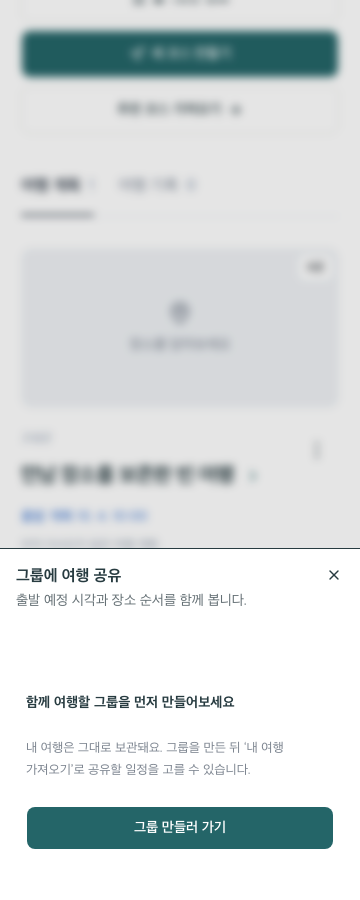

# 여행 계획·공유 흐름 점검 — 2026-09-15

## 판단 기준

사용 목적은 ‘함께 만날 사람과 하루를 준비하고, 출타 중 확인하며, 돌아와 기록하기’다. 홈/둘러보기/내 여행의 역할과 읽기·편집 분리는 유지한다. 기능 추가보다 실패 복구, 입력 보존, 공유 범위 이해를 우선했다. TourAPI 기능·정상 호출을 축소하지 않았다.

## 보완 내용

| 상황 | 문제 | 변경 |
|---|---|---|
| 만남 장소 조회 실패 중 제목 수정 | 저장하면 원래 만남 장소 ID가 빈 값으로 바뀜 | 선택된 ID를 보존. 일시 누락은 다시 확인 버튼으로 복구하며 이동시간을 지어내지 않음 |
| 관광정보 일시 오류 뒤 재시도 | HTTP 429/503이 페이지 메모리 캐시에 계속 남음 | 실패 응답만 완료 후 제거. 성공 응답·동시 요청 공유·계정 분리 유지. 늦은 실패가 새 성공 캐시를 지우지 않음 |
| 일정 보기의 장소 누락 | ‘잠시 후 확인’만 있고 복구 조작 없음 | 장소 정보 다시 불러오기. 원래 순서·저장 참조 유지 |
| 직접 장소 입력 후 닫기/뒤로 | 코스 본문을 수정하지 않았으면 확인 없이 내용 소실 | 관광지 직접 입력과 만남 장소/즐겨찾기 입력 모두 계속 입력·명시적 버리기 제공 |
| 가까운 후보에서 문화시설 선택 | 전체 후보가 있으면 빈 목록에 안내 없음 | 선택한 유형의 빈 상태와 관광정보 검색/전체 후보 버튼 |
| 받은 초대 링크를 붙여넣기 | 코드만 허용해 실제로 복사한 링크가 거부됨 | 링크/코드 모두 미리보기·참여. 새/기존 운영 주소 호환, 다른 개발 환경 링크 거부 |
| 여행 또는 공유 그룹 변경 | 앞서 선택한 개인 장소 공유 동의가 따라옴 | 대상이 달라지면 다시 선택. 저장 중 대상/범위 변경 잠금 |
| 공유할 그룹 없음/조회 실패 | 공유 버튼 비활성 또는 설명 없는 그룹 이동 | 불러오기·재시도·그룹 만들기 진입을 구분. 내 여행은 그대로 유지 |
| 장소 0개인 초안 | 비활성 여유 조정·빈 사진 표지가 차지하는 공간 | 장소를 담기 전 해당 요소 숨김. 날짜/교통/빈 코스 저장 기능 유지 |

## 재현 가능한 사용 시나리오

1. **빈 여행 → 첫 장소**: 홈의 새 여행 → 장소 추가 → 유형을 골라 탐색 → 후보가 없으면 관광정보에서 검색. 빈 여행도 저장할 수 있다.
2. **입력 실수 복구**: 직접 추가에서 이름 입력 → 닫기/뒤로 → 계속 입력을 선택하면 이름 유지. 버리기를 명시적으로 선택한 때만 제거.
3. **일시적 관광정보 오류**: 저장한 일정 보기 → 누락 장소의 순서 확인 → 장소 정보 다시 불러오기 → 같은 위치에 복구. 편집 저장도 만남 장소 참조를 보존한다.
4. **그룹 첫 공유**: 내 여행의 더보기 → 그룹에 공유 → 그룹이 없으면 그룹 만들러 가기 → 생성 후 내 여행 가져오기. 그룹/여행을 바꾸면 직접 지정 장소 공유 여부를 다시 선택한다.
5. **초대받은 동행자**: 그룹 → 초대코드로 참여 → 전달받은 전체 링크 붙여넣기 → 초대 확인 → 그룹 이름/공유 설명 확인 → 참여.

## 검증

신규 단위 검사는 HTTP 실패/회복·늦은 실패 경합·초대 URL·환경 분리·도메인 전환·미조회 만남 장소 보존을 다룬다. 기존 `test:itinerary`에는 직접 입력/만남 장소 취소와 버리기, 빈 검색 결과, HTTP 503 뒤 복구, 빈 코스 저장과 그룹 생성 진입을 추가했다. `test:groups-ui`는 실제 로컬 D1 초대 링크 전체를 붙여넣어 참여하는 검사로 확장했다.

브라우저 시험은 실제 물리 휴대폰이 아닌 데스크톱 브라우저의 화면 크기 검사다. 자동 오류 재현은 mock 관광 응답이며 실 API 정상 연동 증거와 구분한다. 최종 실행 결과·배포는 handoff에 기록한다.

## 다음 우선순위

1. 확정 도메인의 DNS/HTTPS → Naver/Google/Kakao 등록 → 새 주소에서 기존 계정·그룹·관광지도 확인. 개발/운영 DB 분리를 유지한다.
2. 처음 사용하는 장병과 동행자 각 1명 이상에게 설명 없이 계획 만들기·초대 참여·개인 복귀 기준 설정을 수행하게 하고, 막힌 단계만 수정한다.
3. 1차 심사 기능설명서/시연에 ‘관광정보 오류에서 복구’, ‘가족/연인/친구 그룹’, ‘개인 기준과 공유 일정 분리’를 실제 화면으로 반영한다. 새 기능 확장은 이 검증 뒤에 결정한다.

## 화면 증빙과 실행 결과

 

- 단위 검사 **108개**, TypeScript 통과.
- Chromium151: 확장한 일정 보기/복구/입력 보호 **360·430·1440px 각 7개 시나리오**, 자바스크립트 오류 없음. [결과](qa/journey-clarity/itinerary/results.json).
- Chromium151: 개인 코스 만들기와 실제 로컬 D1 그룹 초대/참여 **360·1440px** 통과. 그룹 검사에 전체 링크 붙여넣기를 포함했다.
- Chrome153: 기존 개인 코스 흐름 **360·430·1440·1920px** 통과. 수동 IAB360px에서는 실제 관광목록 표시, Kakao 지도 표시와 입력 보호 확인창을 확인했다.
- 중간 실행의 첫 360px 로딩은 HMR 중 타입 오류 수정과 겹쳐 실패했으며 수정 완료 후 같은 검사에 통과했다. 그룹 검사 라벨은 새 ‘초대 링크 또는 코드’에 맞춰 갱신 후 통과했다.
- 이 PC에는 Microsoft Edge가 없어 Edge 검사는 수행하지 못했다. Chromium 결과를 Edge 실검사로 간주하지 않는다.

## 저장소·배포

[PR #29](https://github.com/MySonIsSoldier/gunbeon-yeojido/pull/29) 병합 완료. [전체 CI](https://github.com/MySonIsSoldier/gunbeon-yeojido/actions/runs/34932436559)는 로그인·계정·심사·그룹·일정·둘러보기·가이드·출타·기록·외부 제안 시나리오를 5분40초에 통과했다. 운영 v19/env3와 개발 v2/env2 배포 성공. 운영 인증 주소와 기존 데이터는 유지한다. 정확한 source SHA/배포 ID는 handoff에 기록했다.

새 도메인의 DNS A는 05:28 UTC 현재 99.83.196.71/75.2.85.42이며 서비스 연결 전이다. 커스텀 도메인만 등록한 상태로 HTTPS 성공을 주장하지 않는다.

운영 반영 후 /login, 익명 계정 응답, 1234 체험 입장과 새 /guide 문구를 확인했다. Naver 준비 상태 true·Google false이며 새 OAuth 동의/재로그인은 이번 검사 범위가 아니다. 개인정보를 포함한 응답이나 쿠키는 보고서에 저장하지 않았다.
